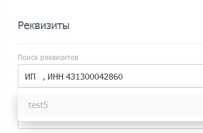
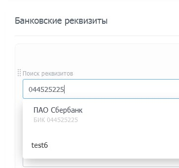

# Места встраивания виджетов Битрикс24

## CALENDAR
- **Виджет в календаре**  
  Код: `CALENDAR_GRIDVIEW`  
  Путь до файла: [api-reference/widgets/calendar.html](https://apidocs.bitrix24.ru/api-reference/widgets/calendar.html)  
  Изображение: 

## CONTACT_CENTER
- **Виджет в контакт-центре**  
  Код: `CONTACT_CENTER`  
  Путь до файла: [api-reference/widgets/contact-center.html](https://apidocs.bitrix24.ru/api-reference/widgets/contact-center.html)  
  Изображение: 

## CRM
- **Пункт контекстного меню дела в карточке элемента**  
  Код: `CRM_XXX_ACTIVITY_TIMELINE_MENU`  
  Путь до файла: [api-reference/widgets/crm/activity-timeline-menu.html](https://apidocs.bitrix24.ru/api-reference/widgets/crm/activity-timeline-menu.html)  
  Изображение: 
- **Пункт контекстного меню дела в карточке элемента**  
  Код: `CRM_DYNAMIC_XXX_ACTIVITY_TIMELINE_MENU`  
  Путь до файла: [api-reference/widgets/crm/activity-timeline-menu.html](https://apidocs.bitrix24.ru/api-reference/widgets/crm/activity-timeline-menu.html)  
  Изображение: 
- **Пункт левого меню CRM-аналитики**  
  Код: `CRM_ANALYTICS_MENU`  
  Путь до файла: [api-reference/widgets/crm/analytics-menu.html](https://apidocs.bitrix24.ru/api-reference/widgets/crm/analytics-menu.html)  
  Изображение: 
- **Пункт выпадающего меню верхней кнопки CRM-аналитики**  
  Код: `CRM_ANALYTICS_TOOLBAR`  
  Путь до файла: [api-reference/widgets/crm/analytics-toolbar.html](https://apidocs.bitrix24.ru/api-reference/widgets/crm/analytics-toolbar.html)  
  Изображение: 
- **Дополнительные возможности встраивания**  
  Код: `CRM_XXX_DETAIL_ACTIVITY`  
  Путь до файла: [api-reference/widgets/crm/detail-activity-area.html](https://apidocs.bitrix24.ru/api-reference/widgets/crm/detail-activity-area.html)  
  Изображение: 
- **Дополнительные возможности встраивания**  
  Код: `CRM_DYNAMIC_XXX_DETAIL_ACTIVITY`  
  Путь до файла: [api-reference/widgets/crm/detail-activity-area.html](https://apidocs.bitrix24.ru/api-reference/widgets/crm/detail-activity-area.html)  
  Изображение: 
- **Кнопка над таймлайном карточки элемента**  
  Код: `CRM_XXX_DETAIL_ACTIVITY`  
  Путь до файла: [api-reference/widgets/crm/detail-activity.html](https://apidocs.bitrix24.ru/api-reference/widgets/crm/detail-activity.html)  
  Изображение: 
- **Кнопка над таймлайном карточки элемента**  
  Код: `CRM_DYNAMIC_XXX_DETAIL_ACTIVITY`  
  Путь до файла: [api-reference/widgets/crm/detail-activity.html](https://apidocs.bitrix24.ru/api-reference/widgets/crm/detail-activity.html)  
  Изображение: 
- **Вкладка в детальной карточке элемента CRM**  
  Код: `CRM_XXX_DETAIL_TAB`  
  Путь до файла: [api-reference/widgets/crm/detail-tab.html](https://apidocs.bitrix24.ru/api-reference/widgets/crm/detail-tab.html)  
  Изображение: 
- **Вкладка в детальной карточке элемента CRM**  
  Код: `CRM_DYNAMIC_XXX_DETAIL_TAB`  
  Путь до файла: [api-reference/widgets/crm/detail-tab.html](https://apidocs.bitrix24.ru/api-reference/widgets/crm/detail-tab.html)  
  Изображение: 
- **Пункт выпадающего меню верхней кнопки карточки элемента**  
  Код: `CRM_XXX_DETAIL_TOOLBAR`  
  Путь до файла: [api-reference/widgets/crm/detail-toolbar.html](https://apidocs.bitrix24.ru/api-reference/widgets/crm/detail-toolbar.html)  
  Изображение: 
- **Пункт выпадающего меню верхней кнопки карточки элемента**  
  Код: `CRM_DYNAMIC_XXX_DETAIL_TOOLBAR`  
  Путь до файла: [api-reference/widgets/crm/detail-toolbar.html](https://apidocs.bitrix24.ru/api-reference/widgets/crm/detail-toolbar.html)  
  Изображение: 
- **Пункт выпадающего меню генератора документов**  
  Код: `CRM_XXX_DOCUMENTGENERATOR_BUTTON`  
  Путь до файла: [api-reference/widgets/crm/document-generator-button.html](https://apidocs.bitrix24.ru/api-reference/widgets/crm/document-generator-button.html)  
  Изображение: Отсутствует
- **Пункт выпадающего меню в туннелях продаж**  
  Код: `CRM_FUNNELS_TOOLBAR`  
  Путь до файла: [api-reference/widgets/crm/funnels-toolbar.html](https://apidocs.bitrix24.ru/api-reference/widgets/crm/funnels-toolbar.html)  
  Изображение: 
- **Пункт контекстного меню в списке элементов**  
  Код: `CRM_XXX_LIST_MENU`  
  Путь до файла: [api-reference/widgets/crm/index.html](https://apidocs.bitrix24.ru/api-reference/widgets/crm/index.html)  
  Изображение: 
- **Пункт контекстного меню в списке элементов**  
  Код: `CRM_DYNAMIC_XXX_LIST_MENU`  
  Путь до файла: [api-reference/widgets/crm/index.html](https://apidocs.bitrix24.ru/api-reference/widgets/crm/index.html)  
  Изображение: 
- **Пункт выпадающего меню над списком элементов**  
  Код: `CRM_XXX_LIST_TOOLBAR`  
  Путь до файла: [api-reference/widgets/crm/list-toolbar.html](https://apidocs.bitrix24.ru/api-reference/widgets/crm/list-toolbar.html)  
  Изображение: 
- **Пункт выпадающего меню над списком элементов**  
  Код: `CRM_DYNAMIC_XXX_LIST_TOOLBAR`  
  Путь до файла: [api-reference/widgets/crm/list-toolbar.html](https://apidocs.bitrix24.ru/api-reference/widgets/crm/list-toolbar.html)  
  Изображение: 
- **Пункт выпадающего меню верхней кнопки дизайнера роботов**  
  Код: `CRM_XXX_ROBOT_DESIGNER_TOOLBAR`  
  Путь до файла: [api-reference/widgets/crm/robot-designer-toolbar.html](https://apidocs.bitrix24.ru/api-reference/widgets/crm/robot-designer-toolbar.html)  
  Изображение: 
- **Взаимодействие с карточкой**  
  Код: `CRM`  
  Путь до файла: [api-reference/widgets/ui-interaction/crm-card.html](https://apidocs.bitrix24.ru/api-reference/widgets/ui-interaction/crm-card.html)  
  Изображение: Отсутствует

## IM
- **Пункт контекстного меню сообщения**  
  Код: `IM_CONTEXT_MENU`  
  Путь до файла: [api-reference/widgets/im/context-menu.html](https://apidocs.bitrix24.ru/api-reference/widgets/im/context-menu.html)  
  Изображение: Отсутствует
- **Иконка левого меню**  
  Код: `IM_NAVIGATION`  
  Путь до файла: [api-reference/widgets/im/index.html](https://apidocs.bitrix24.ru/api-reference/widgets/im/index.html)  
  Изображение: Отсутствует
- **Виджет для сайдбара**  
  Код: `IM_SIDEBAR`  
  Путь до файла: [api-reference/widgets/im/sidebar.html](https://apidocs.bitrix24.ru/api-reference/widgets/im/sidebar.html)  
  Изображение: Отсутствует
- **Коллекция смайлов**  
  Код: `IM_SMILES_SELECTOR`  
  Путь до файла: [api-reference/widgets/im/smile-selector.html](https://apidocs.bitrix24.ru/api-reference/widgets/im/smile-selector.html)  
  Изображение: Отсутствует
- **Виджет над сообщением**  
  Код: `IM_TEXTAREA`  
  Путь до файла: [api-reference/widgets/im/textarea.html](https://apidocs.bitrix24.ru/api-reference/widgets/im/textarea.html)  
  Изображение: Отсутствует

## LANDING
- **Пункт в меню настроек сайта**  
  Код: `LANDING_SETTINGS`  
  Путь до файла: [api-reference/widgets/landings/index.html](https://apidocs.bitrix24.ru/api-reference/widgets/landings/index.html)  
  Изображение: Отсутствует
- **Редактор блока**  
  Код: `LANDING_BLOCK`  
  Путь до файла: [api-reference/widgets/landings/landing-block.html](https://apidocs.bitrix24.ru/api-reference/widgets/landings/landing-block.html)  
  Изображение: Отсутствует

## LEFT_MENU
- **Виджеты в главном меню**  
  Код: `LEFT_MENU`  
  Путь до файла: [api-reference/widgets/left-menu.html](https://apidocs.bitrix24.ru/api-reference/widgets/left-menu.html)  
  Изображение: 

## TASK
- **Пункт контекстного меню списка**  
  Код: `TASK_LIST_CONTEXT_MENU`  
  Путь до файла: [api-reference/widgets/task/index.html](https://apidocs.bitrix24.ru/api-reference/widgets/task/index.html)  
  Изображение: 
- **Пункт основного выпадающего меню**  
  Код: `TASK_USER_LIST_TOOLBAR`  
  Путь до файла: [api-reference/widgets/task/list-toolbar.html](https://apidocs.bitrix24.ru/api-reference/widgets/task/list-toolbar.html)  
  Изображение: 
- **Пункт основного выпадающего меню**  
  Код: `TASK_GROUP_LIST_TOOLBAR`  
  Путь до файла: [api-reference/widgets/task/list-toolbar.html](https://apidocs.bitrix24.ru/api-reference/widgets/task/list-toolbar.html)  
  Изображение: 
- **Пункт основного выпадающего меню около настроек роботов**  
  Код: `TASK_ROBOT_DESIGNER_TOOLBAR`  
  Путь до файла: [api-reference/widgets/task/robot-designer-toolbar.html](https://apidocs.bitrix24.ru/api-reference/widgets/task/robot-designer-toolbar.html)  
  Изображение: 
- **Правая панель карточки задачи**  
  Код: `TASK_VIEW_SIDEBAR`  
  Путь до файла: [api-reference/widgets/task/view-sidebar.html](https://apidocs.bitrix24.ru/api-reference/widgets/task/view-sidebar.html)  
  Изображение: 
- **Вкладка в карточке задачи**  
  Код: `TASK_VIEW_TAB`  
  Путь до файла: [api-reference/widgets/task/view-tab.html](https://apidocs.bitrix24.ru/api-reference/widgets/task/view-tab.html)  
  Изображение: 
- **Ссылка в верхней части карточки задачи**  
  Код: `TASK_VIEW_TOP_PANEL`  
  Путь до файла: [api-reference/widgets/task/view-top-panel.html](https://apidocs.bitrix24.ru/api-reference/widgets/task/view-top-panel.html)  
  Изображение: 

## TELEPHONY
- **Пункт меню в аналитике звонков**  
  Код: `TELEPHONY_ANALYTICS_MENU`  
  Путь до файла: [api-reference/widgets/telephony/analytics-menu.html](https://apidocs.bitrix24.ru/api-reference/widgets/telephony/analytics-menu.html)  
  Изображение: 
- **Вкладка в карточке звонка**  
  Код: `CALL_CARD`  
  Путь до файла: [api-reference/widgets/telephony/index.html](https://apidocs.bitrix24.ru/api-reference/widgets/telephony/index.html)  
  Изображение: 

## UI_INTERACTION
- **Взаимодействие с карточкой звонка**  
  Код: `CALL_CARD`  
  Путь до файла: [api-reference/widgets/ui-interaction/call-card/index.html](https://apidocs.bitrix24.ru/api-reference/widgets/ui-interaction/call-card/index.html)  
  Изображение: 

## REST_APP
- **Виджет в виде ссылки со слайдером**  
  Код: `REST_APP_URI`  
  Путь до файла: [api-reference/widgets/universal/app-url.html](https://apidocs.bitrix24.ru/api-reference/widgets/universal/app-url.html)  
  Изображение: Отсутствует

## PAGE_BACKGROUND
- **Невидимый виджет на каждой странице**  
  Код: `PAGE_BACKGROUND_WORKER`  
  Путь до файла: [api-reference/widgets/universal/background-worker.html](https://apidocs.bitrix24.ru/api-reference/widgets/universal/background-worker.html)  
  Изображение: Отсутствует

## USER_PROFILE
- **Пункт контекстного меню в профиле**  
  Код: `USER_PROFILE_MENU`  
  Путь до файла: [api-reference/widgets/user-profile/profile-menu.html](https://apidocs.bitrix24.ru/api-reference/widgets/user-profile/profile-menu.html)  
  Изображение: 
- **Пункт контекстного меню верхней кнопки профиля**  
  Код: `USER_PROFILE_TOOLBAR`  
  Путь до файла: [api-reference/widgets/user-profile/profile-toolbar.html](https://apidocs.bitrix24.ru/api-reference/widgets/user-profile/profile-toolbar.html)  
  Изображение: 

## SONET_GROUP
- **Пункт основного выпадающего меню проекта**  
  Код: `SONET_GROUP_DETAIL_TAB`  
  Путь до файла: [api-reference/widgets/workgroups/index.html](https://apidocs.bitrix24.ru/api-reference/widgets/workgroups/index.html)  
  Изображение: 
- **Пункт выпадающего меню над списком задач**  
  Код: `TASK_GROUP_LIST_TOOLBAR`  
  Путь до файла: [api-reference/widgets/workgroups/toolbar.html](https://apidocs.bitrix24.ru/api-reference/widgets/workgroups/toolbar.html)  
  Изображение: 
- **Пункт основного выпадающего меню около настроек роботов**  
  Код: `TASK_ROBOT_DESIGNER_TOOLBAR`  
  Путь до файла: [api-reference/widgets/workgroups/robot-designer-toolbar.html](https://apidocs.bitrix24.ru/api-reference/widgets/workgroups/robot-designer-toolbar.html)  
  Изображение: 

# Недокументированные виджеты (описание предположительное, так как информации я не нашел)

## CRM
- **Форма редактирования реквизитов**  
  Код: `CRM_REQUISITE_EDIT_FORM`
- **Автодополнение реквизитов**  
  Код: `CRM_REQUISITE_AUTOCOMPLETE`  
  Изображение: 
- **Автодополнение банковских реквизитов**  
  Код: `CRM_BANK_DETAIL_AUTOCOMPLETE`  
  Изображение: 
- **Поиск в детальной карточке**  
  Код: `CRM_DETAIL_SEARCH`

## TASK
- **Верхнее меню задач**  
  Код: `TASK_TOP_MENU`
- **Режим просмотра задачи**  
  Код: `TASK_VIEW_MODE`
- **Добавление пункта в меню просмотра задачи**  
  Код: `TASK_VIEW_MENU_ADD`

## OTHER
- **Внешний продукт каталога**  
  Код: `CATALOG_EXTERNAL_PRODUCT`
- **Ссылка на зарплату и отпуск**  
  Код: `HCMLINK_SALARY_VACATION`
- **Меню аналитики BI**  
  Код: `BI_ANALYTICS_MENU`
- **Страница 1C**  
  Код: `1C_PAGE`
- **Коннектор настроек ОЛ**  
  Код: `SETTING_CONNECTOR`  
  Путь до файла: [/tutorials/openlines/example-connector.html](https://apidocs.bitrix24.ru/tutorials/openlines/example-connector.html)  упоминается в этой документации, но не описан детально
